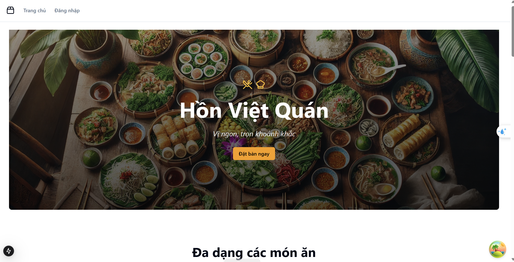
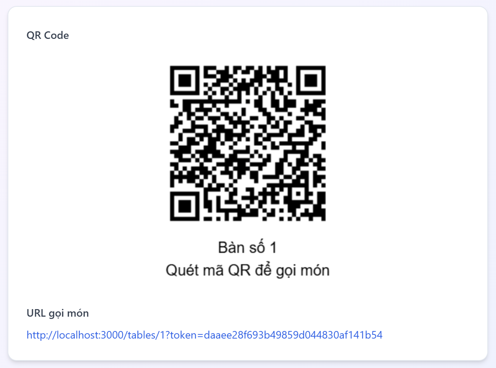
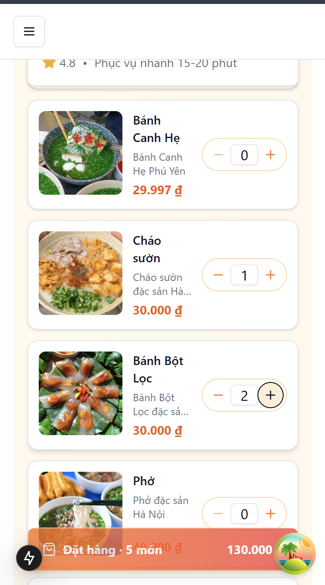
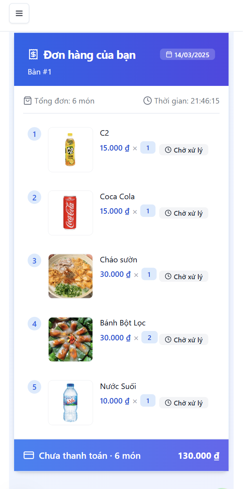
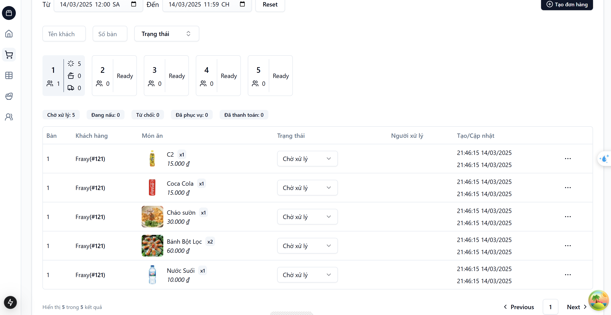
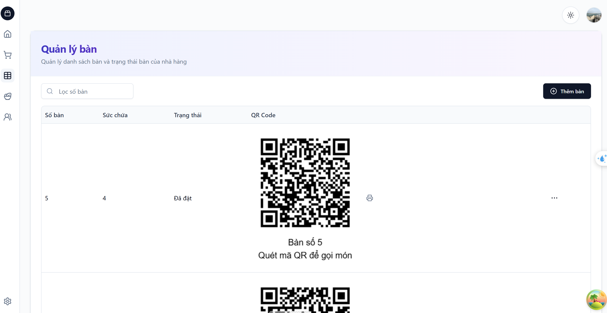
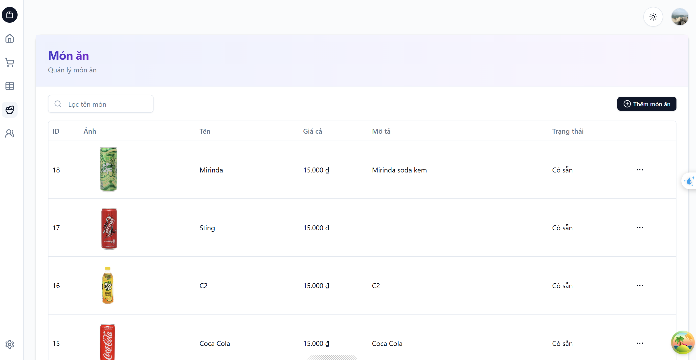
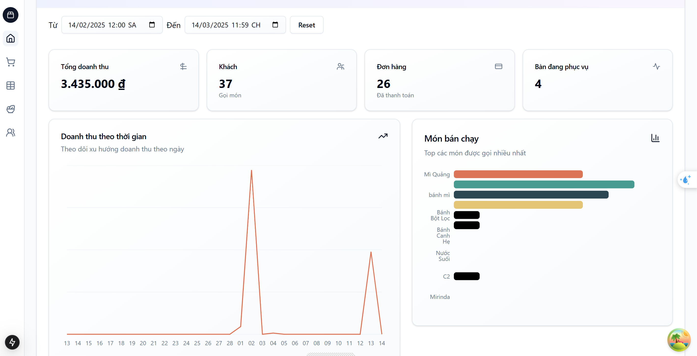
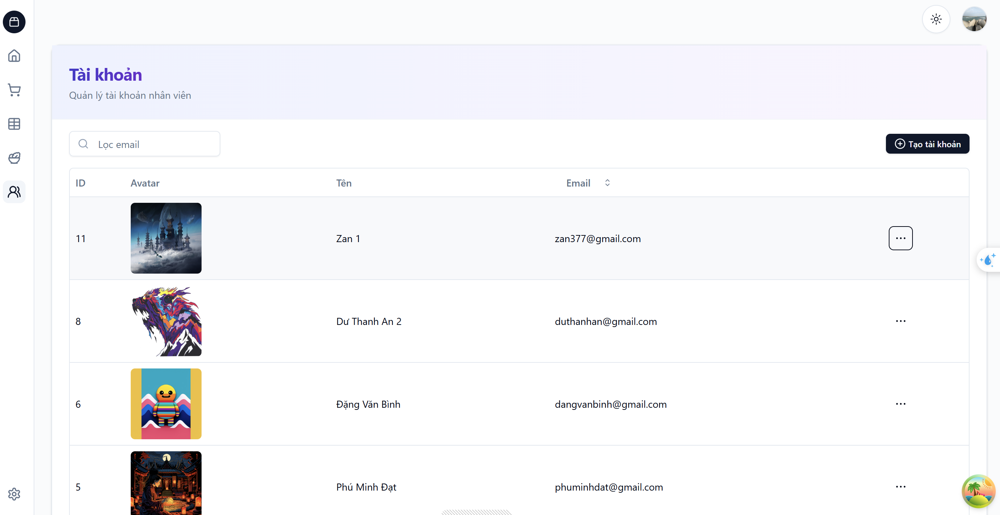

# QR Code Ordering System for Restaurants



## Overview

This project is a comprehensive restaurant management system that allows customers to place orders by scanning QR codes at their tables. It includes both customer-facing interfaces and an administrative dashboard with real-time updates, analytics, and inventory management.

## Key Features

### For Customers
- **QR Code Table Ordering**: Customers scan QR codes at their tables to access the digital menu
- **Intuitive Menu Interface**: Easy-to-navigate digital menu with categories, images, and descriptions
- **Real-time Order Tracking**: Customers can view their order status
- **Easy Customization**: Option to add special requests or modify dishes

### For Restaurant Management
- **Real-time Order Management**: View and manage incoming orders with instant notifications
- **Table Management**: Monitor table status (available, unavailable, reserved)
- **Menu Management**: Add, edit, or remove menu items, and prices
- **Staff Account Management**: Create accounts with different roles and permissions
- **Authentication & Security**: JWT-based authentication system

### Analytics Dashboard
- **Daily Revenue Statistics**: Track sales, customer count, and average spending
- **Order Analytics**: View most popular dishes
- **Table Utilization**: Monitor table turnover and occupancy rates
- **Revenue Trends**: Analyze revenue patterns over time (daily, weekly, monthly)

## Technology Stack

### Frontend
- **Next.js**: For building the user interface
- **Shadcn UI**: For styling components
- **Socket.IO Client**: For real-time communication

### Backend
- **Node.js**: Server-side JavaScript runtime
- **Fastify**: Web application framework
- **SQLLite**: Database for storing menu items, orders, and user data
- **Socket.IO**: For implementing real-time features
- **JWT (JSON Web Tokens)**: For authentication and authorization
- **Prisma**: Object-Relational Mapping for Node.js

## Screenshots

### Customer QR Code Ordering Interface


<br>


### Management Dashboard







## Installation and Setup

### Prerequisites
- Node.js (v18 or higher)
- npm

### Setup Instructions

1. Clone the repository:
   ```bash
   git clone https://github.com/NgKhao/QR-code-ordering-system-for-food-shop.git
   cd QR-code-ordering-system-for-food-shop
   ```

2. Install dependencies for both backend and frontend:
   ```bash
   # Install frontend dependencies
   cd ../client
   npm install
   ```

## Usage Guide

### Customer Flow
1. Customer scans the QR code at their table
2. The digital menu opens on their device
3. They select items and customize as needed
4. They submit the order
5. Real-time updates on order status appear on their device

### Admin/Staff Flow
1. Login to the management dashboard
2. View real-time incoming orders
3. Update order status (received, preparing, ready, delivered, paided)
4. Access analytics and reports
5. Manage menu items, and prices
6. Configure table layouts and QR codes

## Contact

NgKhao - [GitHub Profile](https://github.com/NgKhao)

Project Link: [https://github.com/NgKhao/QR-code-ordering-system-for-food-shop](https://github.com/NgKhao/QR-code-ordering-system-for-food-shop)
